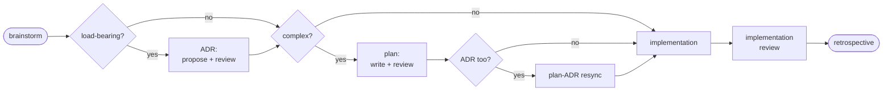
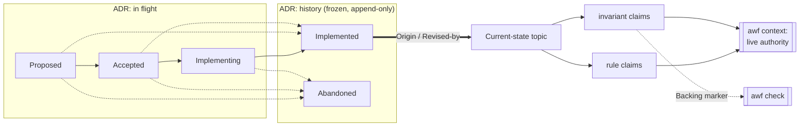

# agentic-workflows

[](https://github.com/hypnotox/agentic-workflows/actions/workflows/ci.yml)
[](https://codecov.io/gh/hypnotox/agentic-workflows?flags%5B0%5D=raw)
[](https://codecov.io/gh/hypnotox/agentic-workflows?flags%5B0%5D=covered)
[](go.mod)
[](LICENSE)
[](#)

`awf` renders an opinionated agentic-development workflow into your repo: a chain of
skills that walk an agent from brainstorm through ADR, plan, implementation, review, and
retrospective; dispatched agents that read or implement with fresh context, reviewers among them; a
contract for dispatched implementation work; and the project docs they all rely on. All of it
is generated from a small `.awf/` config tree
you commit, rendered into the native layout of every coding-agent runtime you enable, and
`awf check` fails the moment a rendered file drifts from the config that produced it.

The tool is a single Go binary. The standard it renders is language-agnostic. Both are
pre-1.0: interfaces may still move before a tagged release.

## Why

Teams working with coding agents accumulate a folklore layer: prompt snippets,
per-developer tweaks to an agent-instruction file, rules that live in one person's head.
Nothing reviews it, nothing enforces it, and it quietly drifts away from how the project
actually works.

awf treats the workflow as a build artifact instead. The source of truth is a committed
config tree, so a change to how your agents work is a diff someone reviews, like any
other change. Rendering is deterministic, so every contributor and every agent session
reads the same skills and docs, with nothing to retype per session. And a set of
mechanical checks guards what the agent produces, not how it reasons: stale or
hand-edited output, invalid skill frontmatter, dead internal links, references to disabled
skills, and invariant claims with no backing marker in source all fail loudly
instead of rotting.

## What gets rendered

- **Workflow skills** (one tree per enabled runtime: `.pi/skills/<prefix>-*/`,
  `.claude/skills/<prefix>-*/`, and so on). The core chain: brainstorming,
  ADR proposal and review, planning and plan review, a plan↔ADR resync, two execution
  styles (inline or subagent-per-task), implementation review, and a closing
  retrospective that promotes recurring findings toward deterministic checks. Task
  skills are opt-in (TDD, bugfix, debugging, a refactor coupling audit, a
  roadmap-graduation pass), except `adr-lifecycle`, which is scaffolded on with the chain.
- **Agents**, likewise per runtime. The review agents (`adr-reviewer`, `plan-reviewer`,
  `code-reviewer`) are each dispatched with fresh context, so the author never grades
  its own work, and are report-only. The `explorer` and `grounding-checker` agents are
  report-only too. The `implementer` agent carries the contract for
  dispatched implementation work, as either a commit-capable phase owner or a
  commit-disabled path-confined helper. Agents are format-neutral before each target
  emits them in its declared native representation; both built-in targets use Markdown.
- **Docs**. An `AGENTS.md` agent guide (with a `CLAUDE.md` bridge for Claude Code),
  workflow and documentation standards, plus opt-in project docs:
  architecture, testing, development, debugging, pitfalls, releasing, glossary, roadmap.
- **Domain docs** (`docs/domains/<name>.md`). One page per freeform domain you
  declare (`awf enable domain rendering`): your hand-authored current-state narrative
  plus a generated compact list of that domain's current-state topics. A domain's sidecar can declare
  `paths` globs (its code territory), and `awf audit` then warns when code in that
  territory changes without the narrative being refreshed.
- **ADR and plan scaffolding** (`docs/decisions/`, `docs/plans/`): a README and a
  template for each, always rendered, so `awf new adr` and `awf new plan` produce the
  shape the review skills and the generated decision index expect.
- **Git-hook payloads** (`.awf/hooks/`): five inert pre-commit, commit-msg,
  pre-merge-commit, reference-transaction, and pre-push scripts. You wire them up;
  awf never touches your Git configuration. Optional commit policy lets the last two
  reject disallowed identities or SSH signatures before local ref movement or push.
- **A command runner** (`x`, opt-in via `awf enable runner`): an executable dispatch
  script giving every repo the same `./x <verb>` entry point. It is co-owned: one section
  is marked edit-in-place, so the verbs you add there survive every `awf render` while awf
  keeps the rest current. awf itself keeps a from-source runner instead.
- **A pinned bootstrap** (`.awf/bootstrap.sh`): an optional installer that fetches the
  exact awf version the repo was rendered with, for hooks and CI.
- **Effort residents** (`.awf/efforts/<slug>/`, `.awf/worktrees/<slug>/`): one concrete non-minimal outcome owns immutable schema-2 state, `memory.md`, and optional mutable protocol-2 `activity.json`; optional managed worktrees use Git-authoritative path, registration, and branch topology. Activity is fallible Pi presence, never authority or a lock, and older binaries need not read an effort after it exists. These two are the only resident roots awf owns; schema generation 22 reset the legacy standalone memory root, and no render recreates it.

awf renders for Pi and [Claude Code](https://www.anthropic.com/claude-code). Each gets
skills and agents at descriptor-owned paths; Claude Code also receives its `CLAUDE.md`
bridge, while Pi owns its runtime extensions. `targets` defaults to `[claude]`; select
one or both built-in runtimes for the project.

A compatible Pi 0.81.1+ build exposing the required queued-command and persisted-session APIs receives trusted project-extension factories for subagents and handoff. The subagent extension registers `subagent_grounding`,
`subagent_explore`, `subagent_review`, and `subagent_implement`. Every role accepts an optional exact
`model` selection and otherwise inherits the parent. Exploration requires `{task, breadth, detail}`:
breadth is `targeted`, `bounded`, or `broad`, and detail is `paths`, `summary`, or `analysis`;
independent calls run through a ten-active FIFO queue. Grounding, exploration, and review are a
no-mutation prompt policy, not an OS sandbox. Implementation shares the checkout, runs alone and
sequentially, and mixed parent batches are mechanically blocked; it commits only when its
orchestrator sets `allowCommits`. Every role shows bounded inline child progress while intermediate
activity stays outside parent model content. Selecting core `effort-workflow` renders a target-neutral guide for entering the exact existing awf-managed worktree through native persistent checkout tooling. Pi additionally derives the `using_effort` tool and companion skill: direct attach or detach leaves the runtime at repository root, heartbeats after turns, and injects fixed relative memory and optional managed-worktree paths before model calls. It publishes advisory Remote Pi metadata plus a negotiated temporary effort name. No checkout validation, CWD replacement, queue, or local TUI presentation is involved; detach and restart restore base identity. Non-Pi targets never receive this tool, claim activity, or create a parallel harness-owned worktree. Existing adopters opt in with `awf enable skill effort-workflow`.

A separate `handoff_session` tool accepts only exact bounded `{kickoff}` prose for a parent-linked fresh persisted TUI session. Workflow checkpoints stay durable and visible first; the handoff runs alone afterward, waits five cancellable seconds, preserves old history, and submits the kickoff unchanged through the replacement context. Unsupported modes reject, cleanup is manual, kickoff failure leaves prepared editor text, and failures after replacement teardown begins are nontransactional.

## The workflow it renders

The rendered skills and agents walk an agent through one canonical chain. Brainstorming is
the hard prerequisite; an ADR is added only when a decision is load-bearing, a plan only when
the work is complex, and a plan-ADR resync runs only when both exist. Every written artifact
gets an independent fresh-context review, and a closing retrospective promotes recurring
findings toward deterministic checks.



Many tasks need neither an ADR nor a plan and go straight from brainstorm to implementation.
See [`docs/workflow.md`](docs/workflow.md) for the full rules.

## How it works

```
.awf/  (you commit this)            rendered output (awf writes & tracks this)
├── config.yaml   enable arrays     ├── AGENTS.md            agent guide
│                 + vars            ├── bridge file          imports AGENTS.md
├── <kind>/<name>.yaml  sidecars    ├── .claude/skills/...   workflow skills
├── <kind>/parts/.../...  overrides ├── .claude/agents/...   agents
└── parts/<name>/...  singletons    └── docs/...             project docs
```

Two systems carry the project's living knowledge, and awf mechanically keeps both honest.

**Decisions become history; current state stays live.** An architecture decision is recorded
as an ADR that moves through a five-state lifecycle and then freezes into append-only history.
Its `Implemented` decisions feed *current-state topics*: per-domain claims about how the code
works right now, split into **rules** and **invariants**, each carrying `Origin` / `Revised-by`
provenance back to the ADRs that established or revised it. The topics, not the ADRs, are the
active authority.



A topic pairs strict metadata (`.awf/topics/metadata/<domain>/<topic>.yaml`) with a constrained
authored part (`.awf/topics/parts/<domain>/<topic>/current-state.md`) and renders to
`docs/topics/`. `awf new topic` scaffolds the pair; `awf topic <domain>/<topic>` reads it back,
active by default, with `--history` resolving removed claim identities.

**`awf context` answers "what governs this request?"** A bare directory is tier-0 orientation:
included/excluded counts, compact groups, classification, provenance, domains, topics, per-topic
authority counts, and bounded pending summaries. A bare exact file or sorted staged/range-selected
file adds tier-1 direct relationships, rendering only its non-empty `State`, `Touches`, and `Proofs`
marker-kind sets. Groups disclose every member only through three files. Repeat `--show` for
`relationships`, `invariants`, `all-rules`, `evidence`, `selectors`, `references`, `pending`, or
`artifacts`; only `artifacts` may refine directory groups, evidence and references only enrich
visible claims, and `--full` is the eight-facet union, never a path census. Human text is the only
contract. Results through 8,192 bytes write unchanged; larger direct-command results securely spill
exact bytes outside the repository and return a two-line notice whose temporary file the successful
caller owns and deletes. In this
repository, `./x context` preserves that output while recording path-free spill observations in the
ignored owner-only `.awf/local/context-spills.log`; logging failures only warn. `./x check` advises
while the log is nonempty, and the operator resolves or promotes the recurring issue and removes it.

**Invariants are enforced, not just documented.** An invariant claim declares its backing:
`Backing: test` requires a matching proof marker (`... invariant: <domain>/<topic>:<slug> (<name>)`)
on a real test, where `<name>` names the unit that proves it and must occur in that same file, so a
marker outlives neither its test nor a rename. `Backing: unbacked` is a reasoned contract that must
carry a `Verify:` line and no marker. `awf check` enforces this symmetrically, so an invariant with no backing in source fails loudly instead of rotting. Rules carry no backing.

Adopting this release from an older awf is a one-time sealed cutover handled by plain `awf
upgrade` (with `awf upgrade --recover` for an interrupted one); the mechanics live in
[`AGENTS.md`](AGENTS.md).

The rendered paths above show the default `claude` target; each enabled runtime keeps
its descriptor-owned layout, and Pi places its artifacts and extensions under `.pi/`.
`awf list target` shows the roster.

You change the config and run `awf render`; you never hand-edit a rendered file.
`awf check` fails when a rendered file is stale or was edited by hand, so the two can't
silently diverge. To customise one section of an artifact, drop a *convention part*
under `.awf/`; it replaces that section's body and inherits the rest of the template.
For skills and agents the catalog doesn't have, `awf new skill <name> "<desc>"` (or
`agent`) scaffolds a project-local artifact that gets the same rendering, validation,
and drift tracking as the built-in ones.

## Install

Download a prebuilt binary for your platform from the
[latest release](https://github.com/hypnotox/agentic-workflows/releases/latest), extract
it, and put `awf` on your `PATH`. It is a single static binary with no runtime
dependencies.

<details>
<summary>Install from source (Go users)</summary>

Requires Go 1.26+.

    go install github.com/hypnotox/agentic-workflows/cmd/awf@latest

</details>

### Pinning with `.awf/bootstrap.sh`

Projects that enable the `bootstrap` artifact (on by default from `awf init`, or
`awf enable bootstrap`) get a small rendered shell script that resolves the exact awf
version the repo was rendered with: it uses an
already-matching `awf` from `PATH` when one exists, otherwise downloads the release
archive, verifies its SHA-256 against the release checksums, caches the binary under
`$XDG_CACHE_HOME/awf/<version>/` (defaulting to `~/.cache`), and prints its path. Hooks
and CI can then run the pinned version without anyone installing awf by hand:

    "$(bash .awf/bootstrap.sh)" check

It touches nothing outside its cache directory, and `awf disable bootstrap` deletes it.
The bootstrap and hook payloads are bash scripts targeting the linux/darwin archives; on
Windows, put `awf` on `PATH` and call it directly.

## Quickstart

    cd your-project
    awf init             # scaffold .awf/, render the workflow core
    awf check            # verify rendered output is in sync
    awf list             # see what's enabled vs available
    awf enable skill tdd    # opt a skill in
    awf enable doc pitfalls # opt a doc in
    awf enable target pi    # render compatible Pi 0.81.1+ skills and trusted extensions

The Pi extension is executable project code loaded behind Pi's project-trust prompt. Its generated
files are drift-checked; use `awf render` to restore missing or modified copies.

`awf init` enables a curated core by default: twelve core skills (the ten-step workflow chain,
`adr-lifecycle`, and `exploring`) and every catalog agent. The workflow, documentation, and agent-guide standards sit outside
the toggleable catalog and always render. Everything else is opt-in via
`awf enable <kind> <name>`, and `awf disable` opts back out.

## Commands

| Command | Purpose |
|---|---|
| `awf init` | Scaffold `.awf/`, seal first-adoption version, and render. ADR format is authored by each record rather than selected by lock cutoffs. Prompts for config values on a TTY; `--describe` prints them as JSON for agents, `--set k=v` / `--answers FILE` fill them non-interactively, and `--set skills=` / `--set docs=` trim the enabled set. `--force` backs up collisions while preserving existing authority provenance. |
| `awf render` | Re-render after a config or template change. |
| `awf check` | Run both verification universes. `check repo` aggregates working-tree `drift` and `state` with tracked-corpus `prose` and `memory`; `check staged` runs the HEAD-to-index state transition and rendered-output drift, while `check staged commit` is direct-only. |
| `awf check commit-policy <revision-or-range>...` | Preview exact author, committer, and optional SSH-signature provenance for explicit targets after the configured baseline. An absent policy succeeds with a disabled note; violations and typed refusals explain reconciliation. It never installs hooks or changes repository state. |
| `awf list [<kind>]` | Show enabled vs available artifacts (`awf list target` shows adapters). |
| `awf enable` / `awf disable <kind> <name>` | Toggle an artifact or adapter. `<kind>` ∈ `skill`, `agent`, `doc`, `domain`, `target`, `bootstrap`, `hooks`, `runner`. Enabling a reviewing skill pulls in the agent it dispatches. |
| `awf new adr "<title>"` | Scaffold the next ADR under `docs/decisions/`. |
| `awf new plan "<title>"` | Scaffold a dated `plan-v2` plan under `docs/plans/`. |
| `awf read plan <plan> <P[.T]>` | Resolve an exact plan filename/stem and print one phase or task executable closure with selected Decisions and phase outcomes; marker-absent historical plans remain legacy and are not projected. |
| `awf new topic <domain> "<title>"` | Scaffold paired topic metadata and authored inputs without syncing; edit paths and author claims manually. |
| `awf effort new --slug <slug> "<outcome>" [--no-worktree] [--base <ref>]` | Require a caller-supplied canonical new slug through 32 bytes and publish unchanged schema-2 state plus always-owned `.awf/efforts/<slug>/memory.md`; existing residents through 63 bytes remain usable, and `list` and `show` provide readable text. Activity remains the JSON-only protocol. |
| `awf effort worktree add|remove <slug>` / `awf effort integrate <slug>` / `awf effort finish <slug>` | Manage optional Git-authoritative topology separately, integrate without committing or reviewing, remove safely without force, and finish by restartable resident deletion last. Pi's derived `using_effort` support remains capability-gated and advisory. |
| `awf new skill\|agent\|doc <name> "<desc>"` | Scaffold a project-local skill, agent, or doc and enable it. |
| `awf audit <base>\|<a>..<b>` | Report workflow-conformance findings over an explicit commit range (a bare `<base>` means `<base>..HEAD`). Required, with no default, so an audit never reports over commits nobody named. It also replays stale-ADR authorization for schema-31-and-later merge commits. Not part of any gate, but exits non-zero on error-severity findings. |
| `awf config` | Describe every config key and var, with this project's live state when run inside one. |
| `awf context <paths>` | Report tier-0 directory orientation and tier-1 exact/staged/range file relationships (`State`, `Touches`, `Proofs`), with per-topic counts and eight named `--show` facets. Only `artifacts` refines groups; `--full` is the facet union. Human output is capped at 8 KiB with secure caller-owned spill delivery above it; `--uncovered` shares the cap. |
| `awf topic <domain>/<topic>[:<claim>]` | Query one topic or claim as deterministic labeled text; `--history` also resolves removed identities as historical-only operation detail. Add other direct detail with `--references` and `--coverage`. |
| `awf check repo prose` | Scan tracked text files for typographic punctuation substitutes; blocking, opt-in per project. |
| `awf check repo memory` | Scan staged decision and plan text for a concrete `.awf/efforts/<slug>/memory.md` citation; blocking and opt-in, with bare-directory and placeholder forms allowed. |
| `awf check staged state` | Validate current-state authority over the HEAD-to-index transition. |
| `awf check staged drift` | Render from the staged config and report only stale or hand-edited staged rendered output; other repository drift kinds are out of scope. |
| `awf check staged commit [FILE]` | Validate Conventional Commits and definitively qualify and authorize older-format ADRs imported by a real merge; built for a `commit-msg` hook. |
| `awf upgrade` | Migrate the `.awf/` tree to the current schema. A bridge-attested project uses plain upgrade for the sealed current-state cutover; `--recover` replays an interrupted cutover's journal. Readiness and attestation modes exist only in the preceding bridge release. |
| `awf uninstall` | Remove awf's generated files while keeping authored configuration and optional local residents. |
| `awf changelog` | Print the embedded changelog (`--version`, `--since`, or `--range`). |
| `awf version` | Print the awf version. |

Run `awf help` for the full synopsis.

## Adopting into an existing repo

`awf init` never silently clobbers your files. If a path it would write (say, an
existing `AGENTS.md`) is present and not awf-managed, init refuses and lists the
collisions; `awf init --force` overwrites them after backing each original up to
`<path>.awf-bak`. First adoption records the running awf version without deriving ADR format authority from corpus numbering. ADRs retain their authored markers, and forced init preserves the recorded version instead of rewriting history. Schema-30 locks with retired routing keys remain readable only as upgrade compatibility input; schema-31 locks omit them.
Rendered skills are named `<prefix>-<skill>`, with the prefix derived from the repo directory's
basename; change it via `prefix` in `.awf/config.yaml`. You can back out anytime: `awf uninstall`
removes everything awf generated, leaving your config in place.

awf renders git-hook *content* but never installs or activates hooks; the wiring is
yours. With the `hooks` artifact enabled (default on init), five inert payload scripts
land under `.awf/hooks/`: `pre-commit.sh` (the configured aggregate check followed by
the project gate), `commit-msg.sh` (`awf check staged commit`), `pre-merge-commit.sh`
(the staged evidence available before the final message and parents),
`reference-transaction.sh` (optional commit-policy enforcement before branch refs move),
and `pre-push.sh` (commit policy before the configured push gate). Preview intended
history with `awf check commit-policy <revision-or-range>...` before enabling a policy.
Invoke payloads from wiring you own. A tracked stub should resolve
`git rev-parse --show-toplevel` and delegate to that worktree's payload so linked
worktrees remain correct with absolute or relative `core.hooksPath`. If you adopted an
earlier awf that ran `awf setup`, your repo's `core.hooksPath` may still point at the
no-longer-rendered `.githooks/`; run `git config --unset core.hooksPath` after upgrading.
Local hooks are bypassable preflight; remote receiving and branch policy remain final.

The `commit-msg` check is definitive for stale-format ADR imports, and `awf audit` replays the same parser and incoming-parent qualification for committed schema-31-and-later merges. A real merge must carry the exact incoming-parent record, apart from sanctioned numbering substitutions, plus adjacent `AWF-Allow-Version: <marker-or-legacy>` and `AWF-Allow-Reason: <nonempty reason>` trailers. Malformed reserved syntax refuses. The index and `MERGE_HEAD` remain intact, so correct the message and run `git commit`; optionally start with `git merge --no-commit --no-ff`. True fast-forwards need no authorization, and an ADR must never be retrofitted or backed by allowance state.

Local hooks are per-clone, so back them with CI. A minimal GitHub Actions job, kept on
the exact awf version the repo was rendered with by the bootstrap:

```yaml
jobs:
  awf:
    runs-on: ubuntu-latest
    steps:
      - uses: actions/checkout@v4
      - name: Drift check (pinned awf)
        run: '"$(bash .awf/bootstrap.sh)" check'
      - name: Gate
        run: make gate # your project's gate command
```

## Documentation

- [`AGENTS.md`](AGENTS.md): the (rendered) agent guide that orients an AI agent in this repo
- [`docs/working-with-awf.md`](docs/working-with-awf.md): day-to-day usage, commands, overrides, the sync/check loop
- [`docs/workflow.md`](docs/workflow.md): the brainstorm/ADR/plan chain and commit discipline
- [`docs/architecture.md`](docs/architecture.md): system shape, packages, key components
- [`docs/decisions/README.md`](docs/decisions/README.md): architecture decision records
- [`docs/development.md`](docs/development.md): local setup and the `./x` command runner

## Contributing

This project develops itself with the workflow it ships, so the rules above apply here
too: never hand-edit a rendered file; change `.awf/` (or a template) and run
`awf render`, then `awf check`. The gate (`./x gate`) must pass before every commit. Read
[`AGENTS.md`](AGENTS.md) and [`docs/workflow.md`](docs/workflow.md) before non-trivial
work.

## License

[GNU Affero General Public License v3.0 only](LICENSE) © hypnotox.

`awf` renders configuration for, and interoperates with, third-party coding agents. It is
an independent project, not affiliated with or endorsed by any of their vendors.
