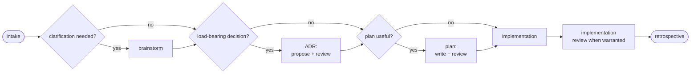
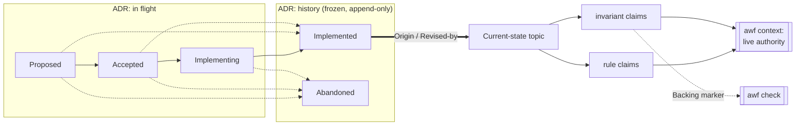

# agentic-workflows

[](https://github.com/hypnotox/agentic-workflows/actions/workflows/ci.yml)
[](https://codecov.io/gh/hypnotox/agentic-workflows?flags%5B0%5D=raw)
[](https://codecov.io/gh/hypnotox/agentic-workflows?flags%5B0%5D=covered)
[](go.mod)
[](LICENSE)
[](#)

`awf` renders an opinionated agentic-development workflow into your repo: a chain of
skills that walk an agent from brainstorm through ADR, plan, implementation, review, and
retrospective; dispatched agents that read or implement with fresh context, reviewers among them; a
contract for dispatched implementation work; and the project docs they all rely on. All of it
is generated from a small `.awf/` config tree
you commit, rendered into the native layout of both built-in coding-agent runtimes, and
`awf check` fails the moment a rendered file drifts from the config that produced it.

The tool is a single Go binary. The standard it renders is language-agnostic. Both are
pre-1.0: interfaces may still move before a tagged release.

## Why

Teams working with coding agents accumulate a folklore layer: prompt snippets,
per-developer tweaks to an agent-instruction file, rules that live in one person's head.
Nothing reviews it, nothing enforces it, and it quietly drifts away from how the project
actually works.

awf treats the workflow as a build artifact instead. The source of truth is a committed
config tree, so a change to how your agents work is a diff someone reviews, like any
other change. Rendering is deterministic, so every contributor and every agent session
reads the same skills and docs, with nothing to retype per session. And a set of
mechanical checks guards what the agent produces, not how it reasons: stale or
hand-edited output, invalid skill frontmatter, dead internal links, invalid skill references,
and invariant claims with no backing marker in source all fail loudly
instead of rotting.

## What gets rendered

- **Workflow skills** (one complete catalog tree per built-in runtime:
  `.pi/skills/<prefix>-*/` and `.claude/skills/<prefix>-*/`). The core chain:
  brainstorming when choices need clarification, ADR proposal and review for load-bearing
  decisions, planning and plan review when sequencing helps, two execution styles (inline
  or subagent-per-task), implementation review when assurance has value, and a closing
  retrospective that promotes recurring findings toward deterministic checks. Ordinary
  plan review owns freshness after a linked ADR changes; there is no separate resync node.
  The same catalog also includes task skills such as TDD, bugfix, debugging, a refactor
  coupling audit, and a roadmap-graduation pass.
- **Agents**, likewise per runtime. The review agents (`adr-reviewer`, `plan-reviewer`,
  `code-reviewer`) are each dispatched with fresh context, so the author never grades
  its own work, and are report-only. The `explorer` and `grounding-checker` agents are
  report-only too. The `implementer` agent carries the contract for
  dispatched implementation work, as either a commit-capable phase owner or a
  commit-disabled path-confined helper. Agents are format-neutral before each target
  emits them in its declared native representation; both built-in targets use Markdown.
- **Docs**. An `AGENTS.md` agent guide (with a `CLAUDE.md` bridge for Claude Code),
  workflow and documentation standards, and the full catalog of project docs:
  architecture, testing, development, debugging, pitfalls, releasing, glossary, and roadmap.
- **Domain docs** (`docs/domains/<name>.md`). One page per freeform domain you
  create (`awf new domain rendering`): your hand-authored current-state narrative
  plus a generated compact list of that domain's current-state topics. A domain's sidecar can declare
  `paths` globs (its code territory), and `awf audit` then warns when code in that
  territory changes without the narrative being refreshed.
- **ADR, plan, and pitfall scaffolding**: `awf new adr` and `awf new plan` produce the
  shapes their review flows and generated indexes expect. `awf new pitfall "<Title>"`
  exclusively creates one canonical authored `.awf/docs/pitfalls/<slug>.md` source and
  reports that path without rendering. Edit the source; the compact generated
  `docs/pitfalls.md` index links to generated leaves, and deleting a source retires its
  row and leaf on the next render.
- **Git-hook payloads** (`.awf/hooks/`): five inert pre-commit, commit-msg,
  pre-merge-commit, reference-transaction, and pre-push scripts. You wire them up;
  awf never touches your Git configuration. Optional commit policy lets the last two
  reject disallowed identities or SSH signatures before local ref movement or push.
- **An awf wrapper** (`awf`, always rendered): a pure executable forwarder that resolves
  the configured awf invocation, then the bootstrap-pinned binary, then `awf` on `PATH`,
  and passes every argument through unchanged. Projects may separately keep their own
  command runner, such as this repository's `x`.
- **A pinned bootstrap** (`.awf/bootstrap.sh`): an optional installer that fetches the
  exact awf version the repo was rendered with, for hooks and CI.
- **Effort residents** (`.awf/efforts/<slug>/`, `.awf/worktrees/<slug>/`, `.awf/effort-archive/`): one concrete non-minimal outcome owns immutable schema-2 state, `memory.md`, optional mutable protocol-2 `activity.json`, and an optional opaque `scratch/` directory that awf neither scaffolds nor traverses; optional managed worktrees use Git-authoritative path, registration, and branch topology. Finish preserves the complete resident at `.awf/effort-archive/<uuid>-<slug>` and releases the slug. The archive is self-ignored, local, unmanaged, non-authoritative, invisible to active effort commands, manually disposable, and potentially present in backups or local disclosure; awf has no archive inventory, restore, prune, analysis, or retention command. Activity is fallible Pi presence, never authority or a lock. Schema generation 42 requires older projects to upgrade before effort commands proceed, so ordinary upgrade rendering publishes the archive marker and current lock; schema generation 22 reset the legacy standalone memory root, and no render recreates it.

awf renders for Pi and [Claude Code](https://www.anthropic.com/claude-code). Each gets
every catalog skill and agent at descriptor-owned paths; Claude Code also receives its
`CLAUDE.md` bridge, while Pi owns its runtime extensions. Both built-in runtimes always render.

A compatible Pi 0.81.1+ build exposing the required queued-command and persisted-session APIs receives trusted project-extension factories for subagents and handoff. The subagent extension registers `subagent_grounding`,
`subagent_explore`, `subagent_review`, and `subagent_implement`. Every role accepts an optional exact
`model` selection and otherwise inherits the parent. Exploration requires `{task, breadth, detail}`:
breadth is `targeted`, `bounded`, or `broad`, and detail is `paths`, `summary`, or `analysis`;
independent calls run through a ten-active FIFO queue. Grounding, exploration, and review are a
no-mutation prompt policy, not an OS sandbox. Implementation starts from the project root, runs
alone and sequentially, and mixed parent batches are mechanically blocked; it commits only when its
orchestrator sets `allowCommits`. Its optional `verificationCheckout` selects the project root or an
exact same-repository managed-worktree root for commit-policy snapshots without changing parent or
child Pi CWD or binding mutation paths; callers keep worktree operations explicit in the task.
Every role shows bounded inline child progress while intermediate
activity stays outside parent model content. The catalog `effort-workflow` renders a target-neutral guide for entering the exact existing awf-managed worktree through native persistent checkout tooling. Pi additionally derives the `using_effort` tool and companion skill: direct attach or detach leaves the runtime at repository root, heartbeats after turns, and injects fixed relative memory and optional managed-worktree paths before model calls. It publishes complete advisory Remote Pi metadata independently from a capability-gated display-only effort suffix, answers replay requests, and clears the suffix on lifecycle boundaries without reading or changing routing identity. Missing or withdrawn suffix support degrades to metadata-only behavior. No checkout validation, CWD replacement, queue, or local TUI presentation is involved. Non-Pi targets never receive this tool, claim activity, or create a parallel harness-owned worktree.

A separate `handoff_session` tool accepts only exact bounded `{kickoff}` prose for a parent-linked fresh persisted TUI session. Workflow checkpoints stay durable and visible first; the handoff runs alone afterward, waits five cancellable seconds, preserves old history, and submits one visible default-rendered `agent-handoff` custom message whose content is `Agent-authored handoff context; this is not user input:` followed by two newlines and the unchanged kickoff. Replacement-bound `sendMessage` triggers the turn; Pi's current provider adapter still converts custom content to a user-role request. Unsupported modes reject, cleanup is manual, and automatic or replacement failure leaves that same envelope in the editor.

## The workflow it renders

The rendered skills and agents implement one workflow whose mechanisms fire independently.
Brainstorming is used when material choices need clarification; an ADR records a load-bearing
decision; a plan is used when sequencing, coordination, or resumability helps. Every written
artifact gets an independent fresh-context review. When a linked ADR changes, ordinary plan
review revalidates each affected Proposed plan and renews affected implementation assurance.
A closing retrospective promotes recurring findings toward deterministic checks.



Many tasks need neither brainstorming, an ADR, nor a plan and go straight from intake to implementation.
See [`docs/workflow.md`](docs/workflow.md) for the full rules.

## How it works

```
.awf/  (you commit this)            rendered output (awf writes & tracks this)
├── config.yaml   repo facts        ├── AGENTS.md            agent guide
│                 + vars            ├── bridge file          imports AGENTS.md
├── <kind>/<name>.yaml  sidecars    ├── .claude/skills/...   workflow skills
├── <kind>/parts/.../...  overrides ├── .claude/agents/...   agents
└── parts/<name>/...  singletons    └── docs/...             project docs
```

Two systems carry the project's living knowledge, and awf mechanically keeps both honest.

**Decisions become history; current state stays live.** An architecture decision is recorded
as an ADR that moves through a five-state lifecycle and then freezes into append-only history.
Its `Implemented` decisions feed *current-state topics*: per-domain claims about how the code
works right now, split into **rules** and **invariants**, each carrying `Origin` / `Revised-by`
provenance back to the ADRs that established or revised it. The topics, not the ADRs, are the
active authority.



A topic pairs strict metadata (`.awf/topics/metadata/<domain>/<topic>.yaml`) with a constrained
authored part (`.awf/topics/parts/<domain>/<topic>/current-state.md`) and renders to
`docs/topics/`. `awf new topic` scaffolds the pair; `awf topic <domain>/<topic>` reads it back,
active by default, with `--history` resolving removed claim identities.

**`awf context` answers "what governs this request?"** A bare directory is tier-0 orientation:
included/excluded counts, compact groups, classification, provenance, domains, topics, per-topic
authority counts, and bounded pending summaries. A bare exact file or sorted staged/range-selected
file adds tier-1 direct relationships, rendering only its non-empty `State`, `Touches`, and `Proofs`
marker-kind sets. Groups disclose every member only through three files. Repeat `--show` for
`relationships`, `invariants`, `all-rules`, `evidence`, `selectors`, `references`, `pending`, or
`artifacts`; only `artifacts` may refine directory groups, evidence and references only enrich
visible claims, and `--full` is the eight-facet union, never a path census. Human text is the only
contract. Results through 8,192 bytes write unchanged; larger direct-command results securely spill
exact bytes outside the repository and return a two-line notice whose temporary file the successful
caller owns and deletes. In this
repository, `./x context` preserves that output while recording path-free spill observations in the
ignored owner-only `.cache/awf-context/context-spills.log`; logging failures only warn. `./x check` advises
while the log is nonempty, and the operator resolves or promotes the recurring issue and removes it.

**Invariants are enforced, not just documented.** An invariant claim declares its backing:
`Backing: test` requires a matching proof marker (`... invariant: <domain>/<topic>:<slug> (<name>)`)
on a real test, where `<name>` names the unit that proves it and must occur in that same file, so a
marker outlives neither its test nor a rename. `Backing: unbacked` is a reasoned contract that must
carry a `Verify:` line and no marker. `awf check` enforces this symmetrically, so an invariant with no backing in source fails loudly instead of rotting. Rules carry no backing.

Adopting this release from an older awf is a one-time sealed cutover handled by plain `awf
upgrade` (with `awf upgrade --recover` for an interrupted one); the mechanics live in
[`AGENTS.md`](AGENTS.md).

The rendered paths above show the Claude Code layout; both built-in runtimes keep their
descriptor-owned layouts, and Pi places its artifacts and extensions under `.pi/`.
`awf list target` shows the fixed roster.

You change the config and run `awf render`; you never hand-edit a rendered file.
`awf check` fails when a rendered file is stale or was edited by hand, so the two can't
silently diverge. Rendered sections use `awf:edit`, opaque regenerated outputs may carry an
informational `awf:source`, and authored ADRs and plans are banner-free. A topic pairs
`.awf/topics/metadata/<domain>/<topic>.yaml` with
`.awf/topics/parts/<domain>/<topic>/current-state.md`; source markers identify reader guidance,
not exhaustive dependencies. For detailed source-editing guidance, see
[`docs/working-with-awf.md`](docs/working-with-awf.md). To customise one section of a catalog
artifact, drop a *convention part* under `.awf/`; it replaces that section's body and inherits
the rest of the template.

## Install

Download a prebuilt binary for your platform from the
[latest release](https://github.com/hypnotox/agentic-workflows/releases/latest), extract
it, and put `awf` on your `PATH`. It is a single static binary with no runtime
dependencies.

<details>
<summary>Install from source (Go users)</summary>

Requires Go 1.26+.

    go install github.com/hypnotox/agentic-workflows/cmd/awf@latest

</details>

### Pinning with `.awf/bootstrap.sh`

Projects with `bootstrap.enabled: true` (the `awf init` default) get a small rendered
shell script that resolves the exact awf version the repo was rendered with: it uses an
already-matching `awf` from `PATH` when one exists, otherwise downloads the release
archive, verifies its SHA-256 against the release checksums, caches the binary under
`$XDG_CACHE_HOME/awf/<version>/` (defaulting to `~/.cache`), and prints its path. Hooks
and CI can then run the pinned version without anyone installing awf by hand:

    "$(bash .awf/bootstrap.sh)" check

It touches nothing outside its cache directory. Set `bootstrap.enabled: false` and render
to remove it. The bootstrap and hook payloads are bash scripts targeting the linux/darwin archives; on
Windows, put `awf` on `PATH` and call it directly.

## Quickstart

    cd your-project
    awf init             # scaffold .awf/ and render the full catalog
    awf check            # verify rendered output is in sync
    awf list             # inventory the catalog and configured domains

The Pi extension is executable project code loaded behind Pi's project-trust prompt. Its generated
files are drift-checked; use `awf render` to restore missing or modified copies.

`awf init` renders every catalog skill, agent, and document for both built-in targets.
`bootstrap.enabled` remains a live, repository-specific toggle.

## Commands

<!-- awf:clispec-commands:start -->
| Command | Purpose |
|---|---|
| `awf init [flags]` | Scaffold .awf/ and render the full catalog |
| `awf render` | Re-render after a template or config change |
| `awf check` | Verify the repository and staged universes |
| `awf read <subcommand>` | Read an executable projection from a parsed artifact |
| `awf audit <base>\|<a>..<b>` | Report workflow-conformance findings over a commit range (advisory) |
| `awf effort <subcommand>` | Manage slugged repository-local efforts |
| `awf adr <subcommand>` | ADR lifecycle operations |
| `awf list [<kind>]` | Show the catalog and configured domain inventory |
| `awf config [<key-or-var>]` | Describe config keys and vars (live state inside a project) |
| `awf context [<path>...] [--show <facet>]... [--full] [--staged] [--range <a>..<b>] [--uncovered]` | Orient by request with compact current-state impact reports |
| `awf topic <domain>/<topic>[:<claim>] [flags]` | Query current claims, history, references, and applicability |
| `awf new <kind> <args>` | Scaffold a new artifact: kind in {adr, plan, topic, domain, pitfall} |
| `awf remove domain <name>` | Remove a configured domain |
| `awf upgrade [--recover]` | Migrate the .awf/ config tree or consume a current-state attestation |
| `awf uninstall` | Remove awf's generated files (keeps .awf/) |
| `awf changelog [--version <v> \| --since <v> \| --range <from>..<to>]` | Print the embedded changelog, or one version/range of it |
| `awf version` | Print the awf version |
<!-- awf:clispec-commands:end -->

Run `awf help` for the full synopsis.

## Adopting into an existing repo

`awf init` never silently clobbers your files. If a path it would write (say, an
existing `AGENTS.md`) is present and not awf-managed, init refuses and lists the
collisions; `awf init --force` overwrites them after backing each original up to
`<path>.awf-bak`. First adoption records the running awf version without deriving ADR format authority from corpus numbering. ADRs retain their authored markers, and forced init preserves the recorded version instead of rewriting history. Schema-30 locks with retired routing keys remain readable only as upgrade compatibility input; schema-31 locks omit them.
Rendered skills are named `<prefix>-<skill>`, with the prefix derived from the repo directory's
basename; change it via `prefix` in `.awf/config.yaml`. You can back out anytime: `awf uninstall`
removes everything awf generated, leaving your config in place.

awf renders git-hook *content* but never installs or activates hooks; the wiring is
yours. Five inert payload scripts render unconditionally under `.awf/hooks/`: `pre-commit.sh` (the configured aggregate check followed by
the project gate), `commit-msg.sh` (`awf check staged commit`), `pre-merge-commit.sh`
(the staged evidence available before the final message and parents),
`reference-transaction.sh` (optional commit-policy enforcement before branch refs move),
and `pre-push.sh` (commit policy before the configured push gate). Preview intended
history with `awf check commit-policy <revision-or-range>...` before enabling a policy.
Adopter-owned wiring activates the otherwise inert payloads. Invoke them from wiring you own. A tracked stub should resolve
`git rev-parse --show-toplevel` and delegate to that worktree's payload so linked
worktrees remain correct with absolute or relative `core.hooksPath`. If you adopted an
earlier awf that ran `awf setup`, your repo's `core.hooksPath` may still point at the
no-longer-rendered `.githooks/`; run `git config --unset core.hooksPath` after upgrading.
Local hooks are bypassable preflight; remote receiving and branch policy remain final.

The `commit-msg` check is definitive for stale-format ADR imports, and `awf audit` replays the same parser and incoming-parent qualification for committed schema-31-and-later merges. A real merge must carry the exact incoming-parent record, apart from sanctioned numbering substitutions, plus adjacent `AWF-Allow-Version: <marker-or-legacy>` and `AWF-Allow-Reason: <nonempty reason>` trailers. Malformed reserved syntax refuses. The index and `MERGE_HEAD` remain intact, so correct the message and run `git commit`; optionally start with `git merge --no-commit --no-ff`. True fast-forwards need no authorization, and an ADR must never be retrofitted or backed by allowance state.

Local hooks are per-clone, so back them with CI. A minimal GitHub Actions job, kept on
the exact awf version the repo was rendered with by the bootstrap:

```yaml
jobs:
  awf:
    runs-on: ubuntu-latest
    steps:
      - uses: actions/checkout@v4
      - name: Drift check (pinned awf)
        run: '"$(bash .awf/bootstrap.sh)" check'
      - name: Gate
        run: make gate # your project's gate command
```

## Documentation

- [`AGENTS.md`](AGENTS.md): the (rendered) agent guide that orients an AI agent in this repo
- [`docs/working-with-awf.md`](docs/working-with-awf.md): day-to-day usage, commands, overrides, the sync/check loop
- [`docs/workflow.md`](docs/workflow.md): the brainstorm/ADR/plan chain and commit discipline
- [`docs/architecture.md`](docs/architecture.md): system shape, packages, key components
- [`docs/decisions/README.md`](docs/decisions/README.md): architecture decision records
- [`docs/development.md`](docs/development.md): local setup and the `./x` command runner

## Contributing

This project develops itself with the workflow it ships, so the rules above apply here
too: never hand-edit a rendered file; change `.awf/` (or a template) and run
`awf render`, then `awf check`. The gate (`./x gate`) must pass before every commit. Read
[`AGENTS.md`](AGENTS.md) and [`docs/workflow.md`](docs/workflow.md) before non-trivial
work.

## License

[GNU Affero General Public License v3.0 only](LICENSE) © hypnotox.

`awf` renders configuration for, and interoperates with, third-party coding agents. It is
an independent project, not affiliated with or endorsed by any of their vendors.

Pi extensions retain the lock-pinned fork-v0.81.1-awf.3 runtime floor, including dynamic active tools and the shared file-mutation queue.
