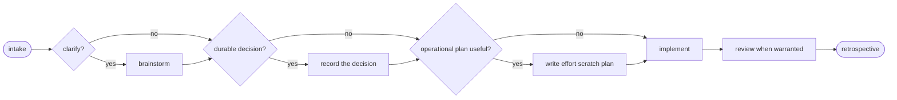

# agentic-workflows

[](https://github.com/hypnotox/agentic-workflows/actions/workflows/ci.yml)
[](https://codecov.io/gh/hypnotox/agentic-workflows?flags%5B0%5D=raw)
[](https://codecov.io/gh/hypnotox/agentic-workflows?flags%5B0%5D=covered)
[](go.mod)
[](LICENSE)
[](#status)

`awf` is a language-agnostic Go CLI for installing a governed agentic-development
workflow. A committed `.awf/` tree renders consistent, reviewable guidance, and `awf
check` detects drift.

## Highlights

- Core and Full governance footprints with one shared correctness, autonomy, maintainability, and review-quality bar
- A workflow from clarification through implementation, review, and retrospective
- Durable decisions for load-bearing choices and effort-local operational plans when sequencing or coordination helps
- Fresh-context agents for exploration, grounding, implementation, and review
- CodeGraph for structural source discovery, architecture, callers, dependencies, and impact analysis; Git for changed-path selection
- Generated agent guides, skills, documentation, and optional Git hook payloads
- Current-state topics that separate live project authority from historical decisions
- Backed invariants that connect documented claims to tests or explicit verification
- Repository-local efforts and managed worktrees for work that needs continuity
- Deterministic rendering and drift checks in local development and CI

## Supported coding agents

awf renders native catalogs for both [Pi](https://github.com/badlogic/pi-mono) and
[Claude Code](https://www.anthropic.com/claude-code). Both targets are generated by
default.

Pi adopters install [`hypnotox/pi-tools`](https://github.com/hypnotox/pi-tools) independently
without pinning a tag or commit, then reload Pi:

```sh
pi install git:git@github.com:hypnotox/pi-tools
```

awf does not pin its revision, so it can be patched or updated without an awf release. Compatibility
is established by a successful protocol-v2 capability handshake and final awf profile registration.
A missing, incompatible, late, or rejected handshake reports an actionable error and activates no
awf fallback. `pi-tools` owns general context usage, handoff, and subagent execution mechanics; awf
renders the workflow-specific profile adapter and, when enabled, its effort integration. CodeGraph
is the expected source-navigation tool for structural discovery, architecture, callers,
dependencies, and impact analysis, while Git selects changed paths. awf does not check that
CodeGraph is installed; its focused read and resolve commands supply normative project authority
that structural navigation cannot infer.

The awf-owned effort extension requires the APIs provided by the
[`fork-v0.84.2.2` Pi release](https://github.com/hypnotox/pi/releases/tag/fork-v0.84.2.2)
or a later compatible build. See all
[Pi fork releases](https://github.com/hypnotox/pi/releases) for downloadable versions.

## Install

Download a binary from the
[latest awf release](https://github.com/hypnotox/agentic-workflows/releases/latest),
extract it, and place `awf` on your `PATH`. Linux tarballs carry portable
`root:root` ownership and ordinary executable and regular-file modes, so a
restricted rootless user namespace can extract them without mapping the release
builder's account.

To install from source with Go 1.26 or later:

```sh
go install github.com/hypnotox/agentic-workflows/cmd/awf@latest
```

## Quickstart

From the repository you want awf to manage:

```sh
awf init
awf check
awf list
```

`awf init` creates a Core `.awf/` tree and renders the workflow. Use `awf init --profile full`
to add durable decisions, current-state authority, and workflow-audit governance. Both footprints use the
same correctness, autonomy, maintainability, and review-quality bar. Existing repositories upgrade
explicitly to Full. Commit both the source tree and its rendered outputs. After changing
`.awf/`, render and check again:

```sh
awf render
awf check
```

If initialization finds an existing file it would replace, it stops and reports the
collision. `awf init --force` first saves each replaced file as `<path>.awf-bak`.

## How it works

```text
.awf/                              rendered output
├── config.yaml                    ├── AGENTS.md
├── <kind>/<name>.yaml             ├── .pi/skills/ and .pi/agents/
├── <kind>/parts/...               ├── .claude/skills/ and .claude/agents/
└── parts/...                      └── docs/
```

Core includes the operational workflow: brainstorming, implementation, testing, review, efforts,
and managed worktrees. Full adds durable decisions, current-state authority, and workflow audit.
An optional operational plan is an unparsed `scratch/plan.md` inside its effort, not permanent project authority. These governance footprints select artifacts,
not different standards of rigor or autonomy.



See [the workflow guide](docs/workflow.md) for the full decision criteria.

## Commands

Punctuation findings are advisory Warnings with zero exit.

<!-- awf:clispec-commands:start -->
| Command | Purpose |
|---|---|
| `awf init [flags]` | Scaffold .awf/ and render the selected governance footprint |
| `awf render` | Re-render after a template or config change |
| `awf edit <kind> <name> <part> --content <text>` | Replace one semantically identified artifact part |
| `awf reset <kind> <name> <part>` | Restore one semantically identified artifact part |
| `awf check` | Verify the repository and staged universes |
| `awf read <subcommand>` | Read a focused current-state authority projection |
| `awf resolve topic <path>...` | Resolve lexical paths to current-state authority |
| `awf audit <base>\|<a>..<b>` | Report workflow-conformance findings over a commit range (advisory) |
| `awf effort <subcommand>` | Manage slugged repository-local efforts |
| `awf list [<kind>]` | Show the catalog and configured domain inventory |
| `awf config [<key-or-var>]` | Describe config keys and vars (live state inside a project) |
| `awf new <kind> <args>` | Scaffold a new artifact: kind in {topic, domain, pitfall, doc} |
| `awf remove domain <name>` | Remove a configured domain |
| `awf upgrade [--recover]` | Migrate the .awf/ config tree or recover an interrupted upgrade |
| `awf uninstall` | Remove awf's generated files (keeps .awf/) |
| `awf changelog [--version <v> \| --since <v> \| --range <from>..<to>]` | Print the embedded changelog, or one version/range of it |
| `awf version` | Print the awf version |
<!-- awf:clispec-commands:end -->

Use `awf read topic <domain>/<topic>[:<claim>]` for focused authority. Use `awf resolve topic <path>...` for lexical path ownership and `awf resolve topic --uncovered` for the whole-repository unowned-path census. A path with no authority reports `none` successfully; `awf check` remains the enforcement oracle.

Run `awf help` for complete usage. See
[Working with awf](docs/working-with-awf.md) for configuration, overrides, upgrades,
hooks, efforts, and day-to-day commands.

## Git hooks and CI

Wire the generated `.awf/hooks/` payloads through your own hook mechanism and run `awf
check` in CI. Enable `.awf/bootstrap.sh` to use the repository-pinned awf release.

## Documentation

- [Working with awf](docs/working-with-awf.md): commands, configuration, and daily use
- [Workflow](docs/workflow.md): the development workflow and commit discipline
- [Configuration reference](docs/config-reference.md): all configuration keys and variables
- [Architecture](docs/architecture.md): system structure and dependencies
- [ADR guide](docs/decisions/README.md): decision format and lifecycle
- [Development](docs/development.md): contributing setup and project commands

## Status

awf is pre-1.0. Interfaces and generated formats may change before a stable release.
Use `awf upgrade` when moving an existing project to a newer schema.

Current limitations remain explicit:

- Adopter `pi-tools` is revision-independent and usable only after a successful protocol-v2 handshake; awf pins only its test support.
- Effort-backed implementation children align with an explicit managed checkout, but parent-session mutation still relies on explicit path targeting and deliberate outside writes are not confined. See [Known Issues](docs/known-issues.md).
- Release archives and checksums share one publication channel. Exact-revision rulesets and workflow gates do not provide independent provenance; immutable releases and attestations remain deferred.
- Linux/amd64 runs exhaustive CI; macOS/arm64 runs native Go behavior. Releases contain Linux and Darwin artifacts for amd64 and arm64; Windows is unsupported.
- The exact-identity coverage ratchet retains a reviewed exception ledger and focused mutation blocker. Coverage-system redesign and broader mutation sampling remain deferred.

Every open repository issue and its completion criteria remains listed in [Known Issues](docs/known-issues.md).

## Contributing

Read [AGENTS.md](AGENTS.md) and [the development guide](docs/development.md).

## License

[GNU Affero General Public License v3.0 only](LICENSE) © hypnotox.

awf interoperates with third-party coding agents and is not affiliated with or endorsed
by their vendors.
