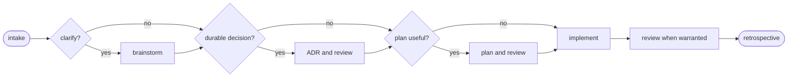

# agentic-workflows

[](https://github.com/hypnotox/agentic-workflows/actions/workflows/ci.yml)
[](https://codecov.io/gh/hypnotox/agentic-workflows?flags%5B0%5D=raw)
[](https://codecov.io/gh/hypnotox/agentic-workflows?flags%5B0%5D=covered)
[](go.mod)
[](LICENSE)
[](#status)

`awf` is a language-agnostic Go CLI for installing a governed agentic-development
workflow. A committed `.awf/` tree renders consistent, reviewable guidance, and `awf
check` detects drift.

## Highlights

- Core and Full workflow profiles: Core for operational coding discipline, Full for governed ADR, plan, and current-state authority
- A workflow from clarification through implementation, review, and retrospective
- ADRs for load-bearing decisions and plans when sequencing or coordination helps
- Fresh-context agents for exploration, grounding, implementation, and review
- Generated agent guides, skills, documentation, and optional Git hook payloads
- Current-state topics that separate live project authority from historical decisions
- Backed invariants that connect documented claims to tests or explicit verification
- Repository-local efforts and managed worktrees for work that needs continuity
- Deterministic rendering and drift checks in local development and CI

## Supported coding agents

awf renders native catalogs for both [Pi](https://github.com/badlogic/pi-mono) and
[Claude Code](https://www.anthropic.com/claude-code). Both targets are generated by
default.

The generated Pi extensions require the APIs provided by the
[`fork-v0.81.1-awf.3` Pi release](https://github.com/hypnotox/pi/releases/tag/fork-v0.81.1-awf.3)
or a later compatible build. See all
[Pi fork releases](https://github.com/hypnotox/pi/releases) for downloadable versions.

## Install

Download a binary from the
[latest awf release](https://github.com/hypnotox/agentic-workflows/releases/latest),
extract it, and place `awf` on your `PATH`.

To install from source with Go 1.26 or later:

```sh
go install github.com/hypnotox/agentic-workflows/cmd/awf@latest
```

## Quickstart

From the repository you want awf to manage:

```sh
awf init
awf check
awf list
```

`awf init` creates a Core `.awf/` tree and renders the workflow. Use `awf init --profile full`
for ADR, plan, current-state, context, and workflow-audit governance. Existing repositories
upgrade explicitly to Full. Commit both the source tree and its rendered outputs. After changing
`.awf/`, render and check again:

```sh
awf render
awf check
```

If initialization finds an existing file it would replace, it stops and reports the
collision. `awf init --force` first saves each replaced file as `<path>.awf-bak`.

## How it works

```text
.awf/                              rendered output
├── config.yaml                    ├── AGENTS.md
├── <kind>/<name>.yaml             ├── .pi/skills/ and .pi/agents/
├── <kind>/parts/...               ├── .claude/skills/ and .claude/agents/
└── parts/...                      └── docs/
```

Core supplies brainstorming, implementation, testing, review, efforts, and managed worktrees.
Full adds ADRs for durable decisions, plans for sequenced work, current-state authority, context,
and workflow audit.



See [the workflow guide](docs/workflow.md) for the full decision criteria.

## Commands

<!-- awf:clispec-commands:start -->
| Command | Purpose |
|---|---|
| `awf init [flags]` | Scaffold .awf/ and render the full catalog |
| `awf render` | Re-render after a template or config change |
| `awf check` | Verify the repository and staged universes |
| `awf read <subcommand>` | Read an executable projection from a parsed artifact |
| `awf audit <base>\|<a>..<b>` | Report workflow-conformance findings over a commit range (advisory) |
| `awf effort <subcommand>` | Manage slugged repository-local efforts |
| `awf adr <subcommand>` | ADR lifecycle operations |
| `awf list [<kind>]` | Show the catalog and configured domain inventory |
| `awf config [<key-or-var>]` | Describe config keys and vars (live state inside a project) |
| `awf context [<path>...] [--show <facet>]... [--full] [--staged] [--range <a>..<b>] [--uncovered]` | Orient by request with compact current-state impact reports |
| `awf topic <domain>/<topic>[:<claim>] [flags]` | Query current claims, history, references, and applicability |
| `awf new <kind> <args>` | Scaffold a new artifact: kind in {adr, plan, topic, domain, pitfall, doc} |
| `awf remove domain <name>` | Remove a configured domain |
| `awf upgrade [--recover]` | Migrate the .awf/ config tree or consume a current-state attestation |
| `awf uninstall` | Remove awf's generated files (keeps .awf/) |
| `awf changelog [--version <v> \| --since <v> \| --range <from>..<to>]` | Print the embedded changelog, or one version/range of it |
| `awf version` | Print the awf version |
<!-- awf:clispec-commands:end -->

Run `awf help` for complete usage. See
[Working with awf](docs/working-with-awf.md) for configuration, overrides, upgrades,
hooks, efforts, and day-to-day commands.

## Git hooks and CI

Wire the generated `.awf/hooks/` payloads through your own hook mechanism and run `awf
check` in CI. Enable `.awf/bootstrap.sh` to use the repository-pinned awf release.

## Documentation

- [Working with awf](docs/working-with-awf.md): commands, configuration, and daily use
- [Workflow](docs/workflow.md): the development workflow and commit discipline
- [Configuration reference](docs/config-reference.md): all configuration keys and variables
- [Architecture](docs/architecture.md): system structure and dependencies
- [ADR guide](docs/decisions/README.md): decision format and lifecycle
- [Development](docs/development.md): contributing setup and project commands

## Status

awf is pre-1.0. Interfaces and generated formats may change before a stable release.
Use `awf upgrade` when moving an existing project to a newer schema.

## Contributing

Read [AGENTS.md](AGENTS.md) and [the development guide](docs/development.md).

## License

[GNU Affero General Public License v3.0 only](LICENSE) © hypnotox.

awf interoperates with third-party coding agents and is not affiliated with or endorsed
by their vendors.
